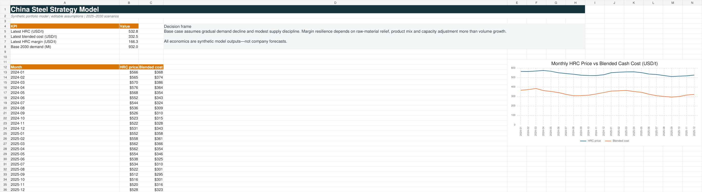
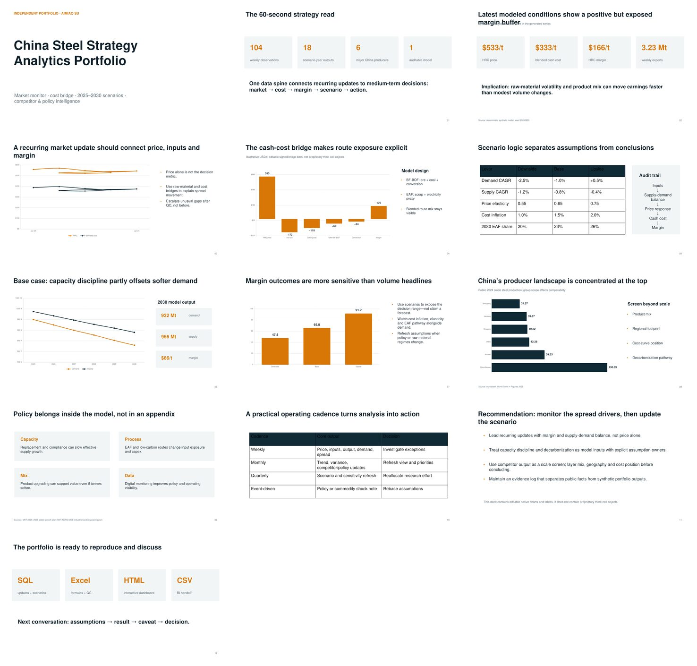

# China Steel Strategy Analytics Portfolio

> Independent portfolio by **Aimiao Su** — synthetic market economics, cited public industry context, and no confidential company data.

An end-to-end strategy case tailored to a Corporate Strategy Analyst internship: recurring China steel/commodity updates, raw-material economics, a 2025–2030 scenario model, public competitor intelligence, a policy special topic, Excel, SQL, an editable executive deck, and a browser dashboard.

**中文导航：** 这是一个面向钢铁行业战略分析岗位的独立作品集。核心内容包括周/月度市场跟踪、原材料成本与钢材利润桥、2025–2030 情景模型、主要中国钢企公开信息对标、产业政策专题、Excel 模型、SQL、交互式网页仪表盘和英文汇报材料。所有市场序列与预测结果均为合成数据。

## 60-second walkthrough

| Time | Open | What it demonstrates |
|---:|---|---|
| 0–10s | [`dashboard/index.html`](dashboard/index.html) | Executive-first market, margin, scenario and competitor monitoring |
| 10–25s | [`workbook/china_steel_strategy_model.xlsx`](workbook/china_steel_strategy_model.xlsx) | Visible assumptions, Excel formulas, native charts and QC |
| 25–40s | [`deck/china_steel_strategy_brief.pdf`](deck/china_steel_strategy_brief.pdf) | 13-slide consulting-style storyline and recommendations |
| 40–50s | [`sql/analysis_queries.sql`](sql/analysis_queries.sql) | Weekly/monthly updates, scenarios and competitor queries |
| 50–60s | [`docs/MICRO_ECONOMICS_MODEL.md`](docs/MICRO_ECONOMICS_MODEL.md) | Supply-demand logic, cost bridge, sensitivities and limitations |

## Portfolio-model findings

- The latest synthetic week ends at **$533/t HRC**, **$333/t blended cash cost**, and **$166/t modeled HRC margin**. These are generated values, not observed market quotes.
- In the base scenario, modeled 2030 demand is **932.0 Mt** versus **955.8 Mt** supply; margin is **$65.8/t**. The scenario range is **$47.8–$91.7/t**.
- The model suggests that raw-material relief, process mix and capacity discipline can matter more to margin than modest volume movement. This is an implication of the portfolio assumptions, not an employer or industry forecast.
- Public context: worldsteel reported **1,005.1 Mt** of China crude steel production in 2024 and ranks China Baowu first globally by 2024 output. See [provenance and disclosures](DATA_DISCLAIMER.md).

## Role-fit matrix

| Target responsibility | Evidence in this repository |
|---|---|
| Desk research and industry trends | Cited [competitor profiles](docs/COMPETITOR_PROFILES.md) and [policy note](docs/POLICY_NOTE.md) |
| Weekly/monthly market updates | 104-week dataset, monthly BI extract, SQL update queries and dashboard |
| Micro-economics modeling | Assumption-led demand/supply, price response, route cost, margin and EAF sensitivities |
| China producer comparison | Six public-source profiles and ranked 2024 output comparison |
| Advanced Excel | Structured source table, editable assumptions, formulas, QC and native charts |
| Executive communication | Editable [PowerPoint](deck/china_steel_strategy_brief.pptx) and [PDF preview](deck/china_steel_strategy_brief.pdf) |
| BI readiness | Import-ready CSVs plus [BI handoff](docs/BI_HANDOFF.md) |
| Detail orientation | Deterministic seed, SQLite model, SQL tests, workbook checks and CI |

## Visual preview





## Repository map

```text
dashboard/      self-contained offline HTML dashboard
data/raw/       synthetic weekly inputs + public competitor table
data/processed/ monthly and scenario BI-ready extracts
data/           ready-to-query SQLite database
sql/            schema, analysis queries and data-quality tests
workbook/       formula-driven Excel model
deck/           editable PPTX + PDF preview
docs/           model note, policy note, competitor profiles, BI handoff, interview prep
scripts/        clean-check validation entry point
```

## Reproduce and validate

Requirements: Python 3.10+; SQLite is optional for interactive querying.

```bash
git clone https://github.com/aimiaosu-blip/steel-strategy-analytics-portfolio.git
cd steel-strategy-analytics-portfolio
python scripts/rebuild.py --check
python scripts/generate_data.py   # optional: regenerate deterministic synthetic data
python -m http.server 8000 -d dashboard
```

Then open `http://localhost:8000`. Query the ready database with:

```bash
sqlite3 data/steel_strategy.sqlite < sql/quality_tests.sql
sqlite3 data/steel_strategy.sqlite < sql/analysis_queries.sql
```

## Methods and integrity

- Fixed seed: `20260809`; 104 weekly observations and 18 scenario-year outputs.
- Synthetic series are calibrated only to plausible public-industry ranges and are never presented as actual quotes, forecasts or employer achievements.
- Competitor tonnage is public-source factual context; model economics remain synthetic.
- The Excel file uses formula-backed pivot-style summaries and native charts. The authoring environment does **not** create genuine PivotTable cache objects, so no real PivotTable object is claimed.
- The PowerPoint uses editable native charts/tables and does **not** contain proprietary think-cell objects.
- Static HTML is file-refresh based, not a live market feed. Tableau/Power BI can import the supplied CSVs.

## Sources

- [worldsteel — December 2024 and 2024 global totals](https://worldsteel.org/media/press-releases/2025/december-2024-crude-steel-production-and-2024-global-totals/)
- [worldsteel — World Steel in Figures 2025](https://worldsteel.org/data/world-steel-in-figures/world-steel-in-figures-2025/)
- [China NBS — Industrial Production Operation in December 2024](https://www.stats.gov.cn/english/PressRelease/202501/t20250124_1958448.html)
- [MIIT — Steel Industry Stable Growth Work Plan (2025–2026)](https://www.miit.gov.cn/jgsj/ycls/wjfb/art/2025/art_854c86c1f4484bcfa78a6b634a7fb5b1.html)
- [MIIT/NDRC/MEE — Industrial Carbon Peaking Implementation Plan](https://wap.miit.gov.cn/threestrategy/dtzx/zhzx/art/2022/art_8134649f6c4e4040a217b980a5f34fdc.html)

## Interview and resume handoff

See [`docs/INTERVIEW_TALKING_POINTS.md`](docs/INTERVIEW_TALKING_POINTS.md) for a concise walkthrough and two truthful resume bullets. Aimiao Su is pursuing a Master’s in Marketing at Stockholm University (expected 2027) and brings prior experience in data governance, market research, workflow automation, SQL, KPI monitoring and executive reporting. This repository does not claim any portfolio result as a prior-employer achievement.
